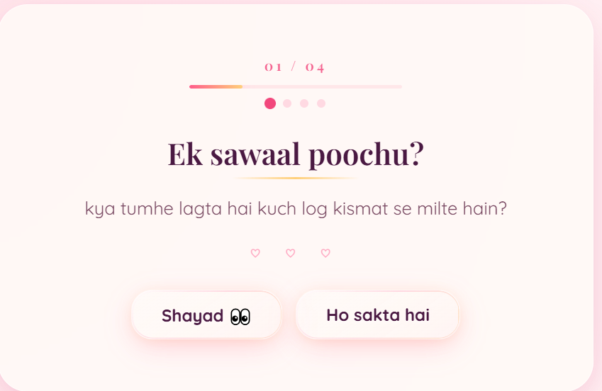

# Love Project 💗

A romantic, interactive **Hinglish proposal website** built with React + Vite.  
Soft glassmorphism, animated hearts & flowers, playful question flow, and a runaway **"Nahi"** button — made to feel personal, dreamy, and classy.

<p align="center">
  
</p>

---

## ✨ Preview

### Question flow
Curiosity-building questions with animated decor, glass buttons, and smooth step transitions.

<p align="center">
  
</p>

### The big moment
A heartfelt proposal screen — **"Mere banoge? 💫"** — with a glowing **Yes** button and a **No** button that dodges across the screen.

### Celebration
Confetti hearts, teddy bear, and a sweet success message when she says yes.

---

## 🌹 Features

| Feature | Description |
|--------|-------------|
| **Hinglish story flow** | 4 warm-up questions → proposal → celebration |
| **Glassmorphism UI** | Blush pink, soft gold, dreamy glass buttons with ripple & sheen |
| **Animated hearts & flowers** | Pure CSS blooms beside every question |
| **Romantic transitions** | Staggered enter/exit, heart burst on each answer, card glow |
| **Runaway "Nahi" button** | Dodges on hover/touch, stays inside the screen |
| **Custom background** | Full-page `BG.webp` with a light romantic overlay |
| **Accessible motion** | Respects `prefers-reduced-motion` |

<p align="center">
  
</p>

---

## 🚀 Quick start

### Prerequisites
- [Node.js](https://nodejs.org/) 18+

### Install & run

```bash
git clone <your-repo-url>
cd loveproject-main
npm install
npm run dev
```

Open **http://localhost:5173/** in your browser.

### Build for production

```bash
npm run build
npm run preview
```

---

## 🎨 Customize it (make it yours)

All personal text lives in one place:

**`src/components/LovePurposeHindi.jsx`** → `CONFIG` object

```js
const CONFIG = {
  questions: [ /* your questions */ ],
  finalHeadline: "Tum wo chapter ho jiski expect nahi thi.",
  finalSub: "Aur main is story ko yahin khatam nahi karna chahta.",
  bigQuestion: "Mere banoge? 💫",
  acceptLabel: "Haan, banungi 💗",
  rejectLabel: "Nahi",
  successTitle: "Pakka ho gaya 💍",
  successMessage: "Best decision! Hamesha aise hi hasate rehne ka promise.",
}
```

### Change the background
Replace **`src/assets/BG.webp`** with your own image (keep the name or update the path in `src/styles/lovePurpose.css`).

### Switch to English
In **`src/components/HomeMain.jsx`**, use `<LovePurpose />` instead of `<LovePurposeHindi />`.

---

## 📁 Project structure

```
loveproject-main/
├── docs/images/          # README screenshots & assets
├── src/
│   ├── assets/           # BG.webp, images
│   ├── components/
│   │   ├── LovePurposeHindi.jsx   # Main Hinglish flow (active)
│   │   ├── LovePurpose.jsx        # English version
│   │   ├── AnimatedFlower.jsx
│   │   ├── AnimatedHeart.jsx
│   │   ├── DodgeNoButton.jsx
│   │   └── AnswerBurst.jsx
│   ├── hooks/
│   │   ├── useGlassRipple.js
│   │   ├── useQuestionTransition.js
│   │   └── useDodgeButton.js
│   └── styles/
│       ├── lovePurpose.css
│       ├── glassButtons.css
│       ├── animatedFlowers.css
│       └── animatedHearts.css
└── package.json
```

---

## 🛠 Tech stack

- **React 19** + **Vite 8**
- **Pure CSS** animations (hearts, flowers, glass, transitions)
- No UI framework — lightweight and personal

---

## 💡 Tips

- Test on mobile — the dodge button uses viewport-safe positioning.
- Tweak overlay strength in `lovePurpose.css` (`.lp-root::after`) if you want the background clearer or softer.
- Deploy easily to [Vercel](https://vercel.com), [Netlify](https://netlify.com), or GitHub Pages after `npm run build`.

---

## ❤️ Made with love

A small, interactive page for one special person — turn the `CONFIG` into your own words and share the link.

<p align="center">
  <strong>Mery Liyay,</strong><br />
  <em>Tum wo chapter ho jiski expect nahi thi.</em> 💫
</p>
